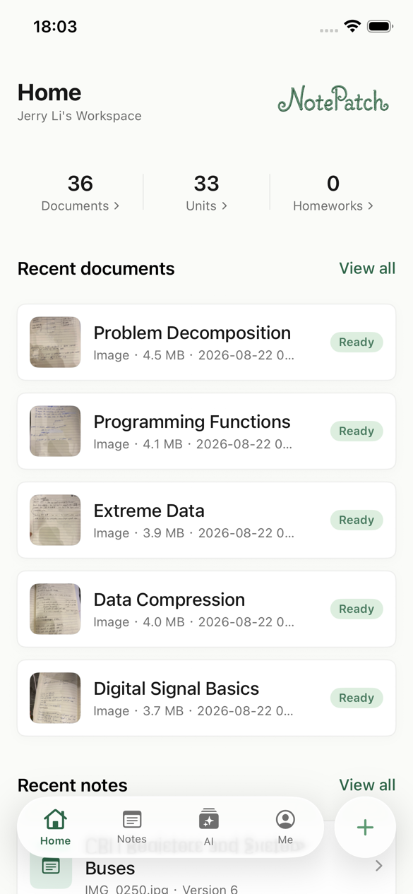
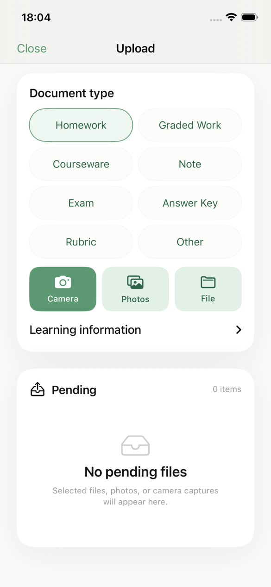
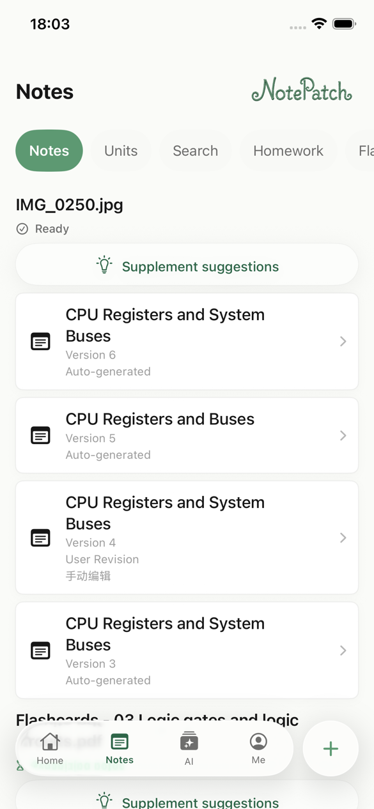
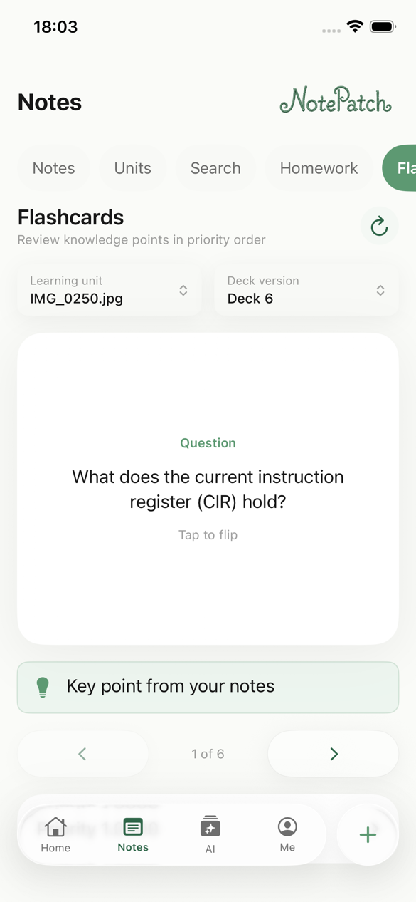
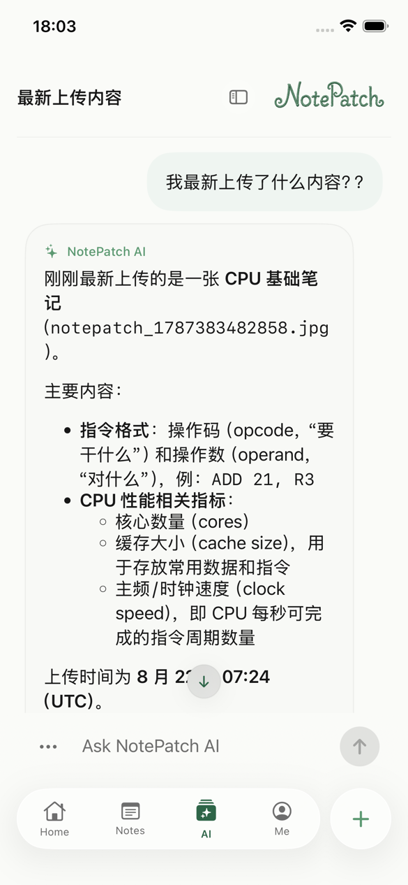
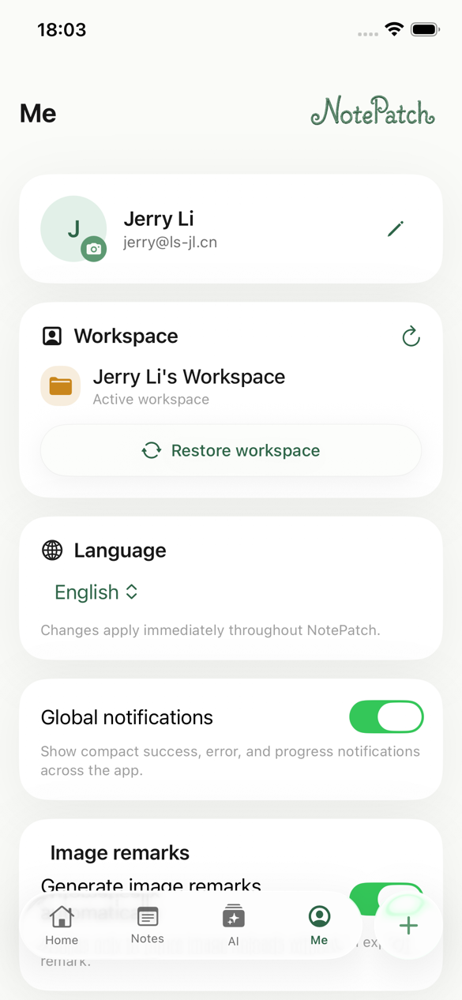
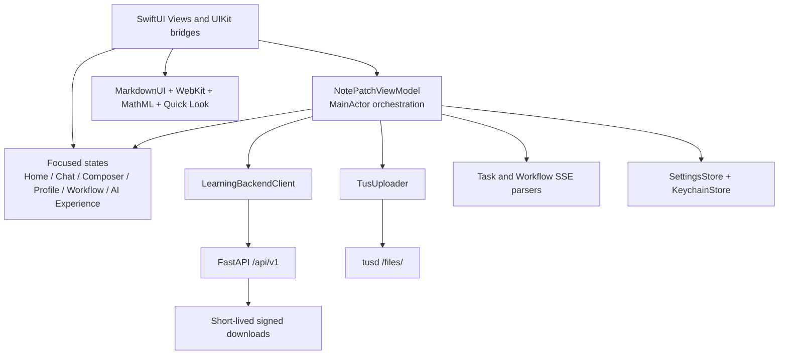

<p align="center">
  
</p>

<h1 align="center">NotePatch for iOS</h1>

<p align="center">
  A native learning workspace that turns documents, images, notes, AI conversations, homework, and review material into one connected study flow.
</p>

<p align="center">
  <a href="README.zh-CN.md"></a>
  
  
  
  
</p>

> [!NOTE]
> This repository contains the native iOS client. Its backend contract is documented in [Frontend Integration Guide](docs/backend-frontend-integration.md). The user app intentionally does not call `/admin/*` or any internal worker, object-storage, OCR, or OpenClaw gateway endpoint directly.

## Table of Contents

- [Overview](#overview)
- [Screenshots](#screenshots)
- [Product Tour](#product-tour)
- [Document Upload and Processing](#document-upload-and-processing)
- [Architecture](#architecture)
- [Backend Configuration](#backend-configuration)
- [Requirements](#requirements)
- [Getting Started](#getting-started)
- [Build and Test](#build-and-test)
- [Offline Test Mode](#offline-test-mode)
- [Localization and Accessibility](#localization-and-accessibility)
- [Security](#security)
- [Current Product Limits](#current-product-limits)
- [Project Layout](#project-layout)
- [Troubleshooting](#troubleshooting)
- [Contributing](#contributing)
- [License](#license)

## Overview

NotePatch is an iPhone-first SwiftUI client for a personal learning workspace. It combines resumable document uploads, OCR and artifacts, versioned HTML study notes, knowledge search, homework grading, flashcards, and persistent AI conversations.

The app uses four primary tabs:

| Tab | Purpose |
| --- | --- |
| **Home** | Workspace metrics, recent documents, recent notes, review shortcuts, and active task entry points. |
| **Notes** | Notes, learning units, knowledge search, homework, grading results, flashcards, note gaps, corrections, and generation workflows. |
| **AI** | Persistent conversations, model selection, streaming answers, reasoning summaries, attachments, citations, and message revisions. |
| **Me** | Profile, avatar, workspace recovery, language, AI/note preferences, image remarks, feedback controls, server settings, and sign out. |

The UI is optimized for both compact devices such as iPhone SE and full-screen devices. The deployment target remains iOS 15.0; newer systems progressively enable native visual effects while older systems use compatible material and surface fallbacks.

## Screenshots

Captured from the signed-in iPhone 17e simulator running iOS 26.5. Click any image to open it at full size.

<table>
  <tr>
    <td align="center"><a href="docs/images/readme/en/home.png"></a><br><sub>Home dashboard</sub></td>
    <td align="center"><a href="docs/images/readme/en/upload.png"></a><br><sub>Upload and document types</sub></td>
    <td align="center"><a href="docs/images/readme/en/notes.png"></a><br><sub>Versioned study notes</sub></td>
  </tr>
  <tr>
    <td align="center"><a href="docs/images/readme/en/flashcards.png"></a><br><sub>Flashcard review</sub></td>
    <td align="center"><a href="docs/images/readme/en/ai.png"></a><br><sub>AI conversation</sub></td>
    <td align="center"><a href="docs/images/readme/en/profile.png"></a><br><sub>Profile and settings</sub></td>
  </tr>
</table>

## Product Tour

### Home

- Shows document, learning-unit, and homework counts without blocking the first frame on secondary data.
- Displays up to five recent documents and three recent note versions.
- Links directly to the full document list, task progress, learning units, and flashcards.
- Loads document data first and defers notes, learning, and AI data until required.

### Notes and Learning

- Groups generated note versions by learning unit and preserves the newest-first version history.
- Reads server-rendered HTML notes in a restricted `WKWebView` and falls back to highlighted/raw HTML for compatible older backends.
- Provides a controlled rich-text editor with undo/redo, bold, italic, headings, lists, and bounded font-size presets.
- Renders formulas through the native HTML/MathML pipeline and supports Markdown/LaTeX in flashcards and AI content.
- Supports continuous multi-image note sets, ordered page uploads, note-generation strategies, knowledge-gap suggestions, corrections, workflow events, and note regeneration.
- Includes learning-unit search, unit merge flows, homework configuration, answer/rubric references, official or diagnostic grading results, grading history, and prioritized flashcard review hints.

### AI

- Runs an onboarding questionnaire before first use and persists the resulting response preferences.
- Loads persistent conversations in a left-side drawer, with create, select, rename, soft-delete, and full-conversation copy operations.
- Streams answer and optional reasoning-summary deltas over task SSE; reconnects with `Last-Event-ID` and falls back to polling where necessary.
- Supports stop/cancel while preserving already streamed text.
- Renders full Markdown including tables, lists, links, block quotes, code blocks, and LaTeX; code blocks expose dedicated copy actions and message text remains selectable.
- Uploads files and multiple photos as chat attachments. Attachments may remain conversation-only or be added to the workspace.
- Allows persisted user messages to be revised, creating a new server-side conversation branch while retaining the existing draft on failure.
- Displays the actual model used by each assistant response and exposes the workspace model catalog in **Me**.

### Me

- Edits display name and email with ETag conflict handling and idempotency keys.
- Uploads and refreshes an avatar through short-lived signed URLs.
- Switches between system language, Simplified Chinese, Traditional Chinese, and English immediately.
- Controls global feedback, AI history, AI response preferences, automatic image remarks, note-generation strategy, retained note versions, and the active AI model.
- Configures and validates API and tus upload endpoints without replacing a user's custom server during default-address migrations.

## Document Upload and Processing

The main upload flow is:

```text
Select camera / photos / files
  -> local pending queue and preview
  -> POST upload-session
  -> resumable tus upload
  -> complete-upload
  -> automatic or explicit processing task
  -> SSE task events (polling fallback)
  -> OCR / artifacts / study workflows
  -> signed download URL and native preview
```

Key behaviors:

- Batch photo and file selection with per-item document kinds and optional learning metadata.
- Local image downsampling and Quick Look thumbnails without decoding large originals on the main thread.
- Upload queue selection, reordering for continuous notes, removal, retry, progress, and isolated cache cleanup.
- Supported kinds include homework, corrected homework, courseware, notes, exams, answer keys, rubrics, and other documents.
- Optional user or automatically generated image remarks, with background status tracking.
- tus URL and upload-ID resolution that preserves the server's public random path prefix.
- Document processing, retry, cancellation, artifact/OCR downloads, logical deletion, and asynchronous purge tracking.
- Image zoom preview, Quick Look for supported documents, and a file-information/share fallback for unknown formats.
- Download caches are isolated by document ID so identically named files cannot overwrite each other.

## Architecture



### State and data flow

- `NotePatchViewModel` owns cross-feature orchestration, workspace generations, task lifecycles, and server-backed mutations.
- Focused observable states isolate frequently changing chat input, navigation, dashboard, profile, learning workflow, and AI onboarding updates from unrelated screens.
- Access and refresh tokens plus the presence client ID are stored in Keychain. Non-sensitive preferences, profile summaries, selected workspace, and server addresses use UserDefaults.
- Token refresh is single-flight: concurrent 401 responses share one refresh request, and stale failures cannot clear a newer session.
- Workspace switches, logout, 403 recovery, and session invalidation cancel in-flight loads and prevent old responses from writing into the new workspace.
- File copying, image orientation normalization, thumbnail generation, HTML reads, and expensive parsing are moved away from the main actor where possible.

### Dependencies

| Dependency | Version | Role |
| --- | --- | --- |
| [`swift-markdown-ui`](https://github.com/gonzalezreal/swift-markdown-ui) | 2.4.1 | Direct dependency for complete SwiftUI Markdown rendering. |
| `NetworkImage` | 6.0.1 | Resolved transitive dependency. |
| `swift-cmark` | 0.8.0 | Resolved transitive CommonMark parser. |

The app also uses Apple frameworks including SwiftUI, UIKit, Combine, Foundation, Security, WebKit, PhotosUI, QuickLook, QuickLookThumbnailing, ImageIO, and UniformTypeIdentifiers.

## Backend Configuration

The checked-in production defaults are public and configurable from **Me > Server**.

| Service | URL |
| --- | --- |
| Service root | `https://8.137.78.255/np-b9a6aede5d0fbb05229d9541144a6067` |
| Health | `https://8.137.78.255/np-b9a6aede5d0fbb05229d9541144a6067/health` |
| FastAPI | `https://8.137.78.255/np-b9a6aede5d0fbb05229d9541144a6067/api/v1` |
| Swagger | `https://8.137.78.255/np-b9a6aede5d0fbb05229d9541144a6067/api/v1/docs` |
| OpenAPI JSON | `https://8.137.78.255/np-b9a6aede5d0fbb05229d9541144a6067/api/v1/openapi.json` |
| tusd | `https://8.137.78.255/np-b9a6aede5d0fbb05229d9541144a6067/files/` |

The API setting is a **service root**, not a full `/api/v1` endpoint. The client appends `/health` for health checks and `/api/v1` for normal requests. The upload field defaults to the full `/files/` endpoint; its normalizer also accepts the service root and resolves it to `/files/`.

The random public prefix is a deployment routing mechanism, not authentication. Every protected request still requires a JWT, workspace authorization remains enforced, and downloads must use FastAPI-issued short-lived URLs. Do not point the client directly at SeaweedFS, Redis, OCR workers, docserver, OpenClaw gateways, model providers, or `/admin/*`.

## Requirements

- macOS with Xcode 26 or later. The current repository was validated with **Xcode 26.6 (17F113)**.
- iOS 15.0 or later. Current screenshots use iPhone 17e / iOS 26.5.
- Internet access for resolving Swift Package Manager dependencies and connecting to the configured backend.
- An Apple Development Team for device builds. Change the signing team and bundle identifier if the checked-in values are not available to your account.

## Getting Started

```bash
git clone https://github.com/NotePatch/NotePatch-iOS.git
cd NotePatch-iOS

DEVELOPER_DIR=/Applications/Xcode.app/Contents/Developer \
  xcodebuild -resolvePackageDependencies \
  -project NotePatch.xcodeproj \
  -scheme NotePatch

open NotePatch.xcodeproj
```

In Xcode:

1. Select the **NotePatch** target.
2. Open **Signing & Capabilities** and choose your development team.
3. Select an iOS 15+ simulator or connected iPhone.
4. Build and run the shared **NotePatch** scheme.
5. Register or sign in, then verify the personal workspace and server settings.

## Build and Test

If `xcrun` points to CommandLineTools, set the full Xcode toolchain explicitly:

```bash
export DEVELOPER_DIR=/Applications/Xcode.app/Contents/Developer
```

### Generic simulator build

```bash
xcodebuild build \
  -project NotePatch.xcodeproj \
  -scheme NotePatch \
  -configuration Debug \
  -destination 'generic/platform=iOS Simulator'
```

### Unit tests

```bash
xcodebuild test \
  -project NotePatch.xcodeproj \
  -scheme NotePatch \
  -destination 'platform=iOS Simulator,name=iPhone 17e,OS=26.5' \
  -only-testing:NotePatchTests
```

### UI tests

```bash
xcodebuild test \
  -project NotePatch.xcodeproj \
  -scheme NotePatch \
  -destination 'platform=iOS Simulator,name=iPhone 17e,OS=26.5' \
  -only-testing:NotePatchUITests
```

The test suite covers request contracts, refresh-token concurrency, tus uploads, SSE parsing and reconnection, model decoding, state isolation, Markdown/HTML/LaTeX rendering, uploads and previews, profiles, notes, grading, flashcards, adaptive layout, accessibility identifiers, keyboard behavior, and offline UI flows.

### Version and build-number automation

The shared scheme runs `scripts/increment-build-number.sh` before builds:

- Release builds increment `CFBundleShortVersionString` by `0.01` and `CFBundleVersion` by `1`.
- Debug builds do not increment unless `NOTE_PATCH_INCREMENT_BUILD_NUMBER=1` is set.
- The script edits tracked values in `Info.plist`; review the resulting diff before committing or archiving.

## Offline Test Mode

For a server-free interactive workbench:

1. Open the normal login screen.
2. Enter `uitest` in the email field.
3. Leave the password empty.
4. Tap **Log in** (not Register).

This creates an in-memory personal workspace with documents, notes, homework, flashcards, conversations, and model fixtures. Login and initial loading make no server requests, and the session is not written to Keychain or UserDefaults. Restarting or signing out removes it.

Offline mode bypasses only login and initial data loading. Explicit network actions such as upload, AI send, search, grading, profile save, or model selection still use the configured server and may return 401 for the fixture token.

Useful UI-test launch arguments include:

| Argument | Purpose |
| --- | --- |
| `-NotePatchUITestWorkbench` | Start directly in the offline workbench. |
| `-NotePatchUITestNoSession` | Force the authentication screen. |
| `-NotePatchUITestLongChat` | Load a long conversation for scrolling and performance checks. |
| `-NotePatchUITestConversations` | Load multiple persisted conversation fixtures. |
| `-NotePatchUITestPendingImage` | Add a pending image to the upload queue. |
| `-NotePatchUITestReasoningStates` | Load answer/reasoning streaming states. |
| `-NotePatchUITestLanguage en` | Force a UI-test language; `zh-Hans` and `zh-Hant` are also supported. |

## Localization and Accessibility

- Complete app-owned UI resources are maintained in English, Simplified Chinese, and Traditional Chinese.
- **Follow System** maps Traditional Chinese scripts/regions to `zh-Hant`, other Chinese locales to `zh-Hans`, and unsupported system languages to English.
- User content, filenames, task events, AI answers, and backend error details remain in their original language.
- Stable accessibility identifiers are used instead of translated labels in UI automation.
- Dynamic Type, VoiceOver actions, text selection, 44-point targets, compact-device layouts, safe areas, keyboard boundaries, and floating-navigation obstruction are covered by dedicated tests.

## Security

- Access tokens, refresh tokens, and the presence client ID are stored in Keychain.
- UserDefaults stores non-sensitive settings and cached account/workspace summaries; chat content is reloaded from the backend rather than persisted as a local history cache.
- File and artifact downloads use short-lived URLs requested from FastAPI. The app does not construct object-storage paths from object keys.
- Rendered notes run in a non-persistent, restricted `WKWebView`. JavaScript, external navigation, popups, event handlers, and untrusted executable content are blocked; the controlled editor runs only bundled scripts.
- Workspace path IDs are escaped and server authorization remains authoritative.
- The current `Info.plist` allows arbitrary ATS loads for local/LAN compatibility. Production configurations should use HTTPS and tighten ATS exceptions when local HTTP support is no longer required.
- Never commit real credentials, refresh tokens, provider keys, signed object URLs, or internal worker endpoints.

## Current Product Limits

- The user app is personal workspace-only. Family/class/school roles, invitations, and membership administration are intentionally absent.
- OCR, layout, tables, and formulas depend on backend workers and real models. Unavailable workers produce explicit task failures rather than local approximations.
- DOCX and PPTX processing relies on a server-side LibreOffice conversion artifact before OCR.
- AI results are schema-validated but may still be incomplete or incorrect.
- Grading without a usable answer key or rubric is diagnostic/provisional. Only supported grading modes are presented as official scores.
- SSE is preferred for tasks and workflows, with reconnect and polling fallbacks; a completed orchestration task may still be followed by background note or flashcard rebuilding.
- The random public path prefix is not a secret and must not be treated as a security boundary.

## Project Layout

```text
NotePatch-iOS/
├── NotePatch/                         # App target
│   ├── ContentView.swift              # Main SwiftUI screens and UIKit bridges
│   ├── NotePatchViewModel.swift       # Cross-feature orchestration
│   ├── LearningBackendClient.swift    # Authenticated HTTP client and refresh flow
│   ├── Models.swift                   # Backend and app-facing models
│   ├── TusUploader.swift              # Resumable file upload
│   ├── TaskSSESupport.swift           # Task event-stream parser
│   ├── WorkflowSSESupport.swift       # Aggregated workflow event stream
│   ├── HTMLNoteSupport.swift          # Safe note reader and rich editor
│   ├── MarkdownSupport.swift          # Cached Markdown render models
│   ├── *State.swift                   # Focused observable feature states
│   ├── *ThumbnailSupport.swift        # Upload/document thumbnail pipelines
│   └── *.lproj/                       # English, Simplified Chinese, Traditional Chinese
├── NotePatchTests/                    # Swift Testing unit and contract tests
├── NotePatchUITests/                  # XCTest UI and performance tests
├── docs/
│   ├── backend-frontend-integration.md
│   └── images/readme/                 # English and Chinese README screenshots
├── scripts/increment-build-number.sh
├── Info.plist
└── NotePatch.xcodeproj
```

## Troubleshooting

### `xcrun: unable to find utility "simctl"`

```bash
export DEVELOPER_DIR=/Applications/Xcode.app/Contents/Developer
xcodebuild -version
```

Also confirm the full Xcode app is installed and selected in Xcode > Settings > Locations.

### Swift package resolution fails

```bash
xcodebuild -resolvePackageDependencies \
  -project NotePatch.xcodeproj \
  -scheme NotePatch
```

Check access to GitHub and retain the checked-in `Package.resolved` unless intentionally updating dependencies.

### Login or requests return 401

The client refreshes once using the saved refresh token. If refresh fails, the session is cleared and login is required. The `uitest` fixture token is intentionally rejected by real server actions.

### Workspace requests return 403

The app clears the selected workspace and reloads the personal workspace list. Confirm the authenticated user owns the requested workspace.

### Upload appears stuck

Verify both the FastAPI root and tusd endpoint, test them from **Me > Server**, and inspect upload-session, tus offset, complete-upload, task, and task-event failures separately. A 409 during completion may be a temporary webhook synchronization delay; unrelated 409 responses are not automatically retried.

### Task streaming disconnects

The client reconnects with the last event sequence and falls back to polling. Persistent failures generally indicate backend queue, gateway, worker, or authorization issues rather than a Markdown rendering problem.

## Contributing

- Keep the app compatible with iOS 15.0 unless the deployment target is deliberately changed.
- Protect newer SwiftUI APIs with availability checks and preserve the older-system visual fallback.
- Add every app-owned string to English, Simplified Chinese, and Traditional Chinese resources.
- Keep stable accessibility identifiers for automated flows; tests should not depend on translated text.
- Update model and URLProtocol tests whenever the backend contract changes.
- Do not call `/admin/*`, SeaweedFS, Redis, OCR/docserver workers, OpenClaw gateways, or provider endpoints from the app.
- Avoid unrelated refactors in contract changes, and keep large file/HTML/image work away from the main actor.
- Run the generic simulator build, relevant unit/UI tests, `plutil -lint`, and `git diff --check` before submitting changes.

## License

This repository currently does not include a license file. Do not assume permission to redistribute, modify, or reuse the project beyond rights granted by applicable law. Contact the maintainers before external reuse.
