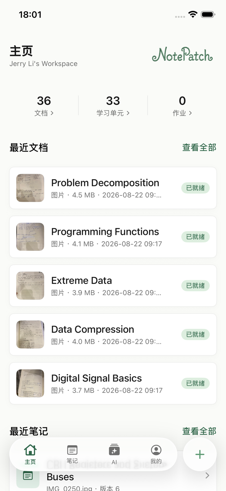
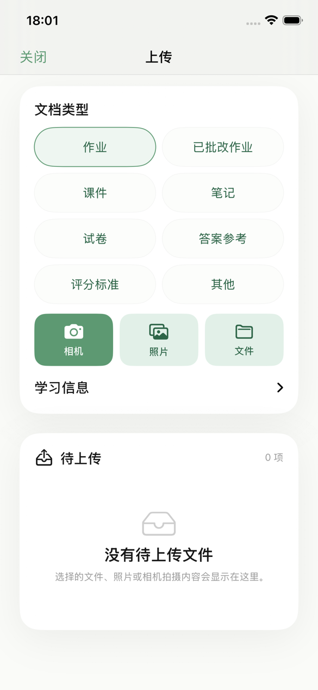
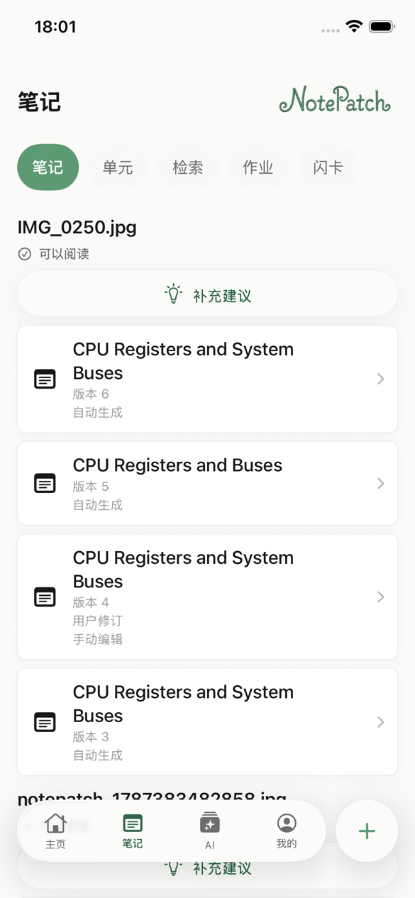
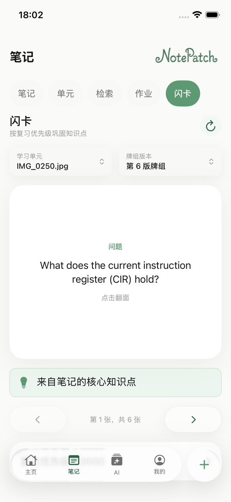
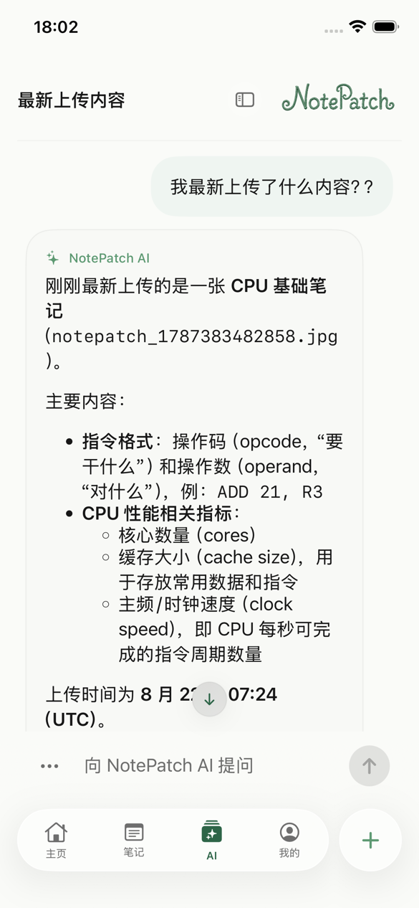
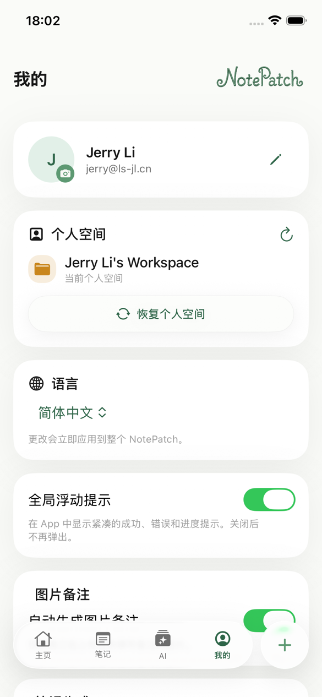
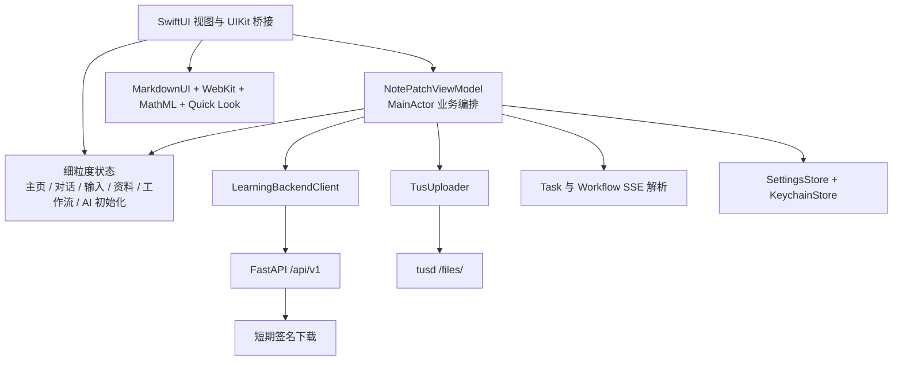

<p align="center">
  
</p>

<h1 align="center">NotePatch iOS</h1>

<p align="center">
  将文档、图片、笔记、AI 对话、作业与复习资料连接成完整学习流程的原生学习工作台。
</p>

<p align="center">
  <a href="README.md"></a>
  
  
  
  
</p>

> [!NOTE]
> 本仓库是 NotePatch 原生 iOS 客户端。后端契约参见 [Frontend Integration Guide](docs/backend-frontend-integration.md)。用户端不会直接调用 `/admin/*`，也不会绕过后端访问内部 worker、对象存储、OCR 或 OpenClaw Gateway。

## 目录

- [项目简介](#项目简介)
- [界面截图](#界面截图)
- [功能导览](#功能导览)
- [文档上传与处理](#文档上传与处理)
- [架构](#架构)
- [后端配置](#后端配置)
- [环境要求](#环境要求)
- [开始使用](#开始使用)
- [构建与测试](#构建与测试)
- [离线测试模式](#离线测试模式)
- [本地化与无障碍](#本地化与无障碍)
- [安全](#安全)
- [当前产品限制](#当前产品限制)
- [项目结构](#项目结构)
- [常见问题](#常见问题)
- [参与开发](#参与开发)
- [许可证](#许可证)

## 项目简介

NotePatch 是一个以 iPhone 为主的 SwiftUI 个人学习工作台。它将可恢复文档上传、OCR 与 Artifact、版本化 HTML 学习笔记、知识检索、作业评分、闪卡和持久化 AI 对话整合到同一个 App 中。

App 使用四个主导航：

| 页面 | 用途 |
| --- | --- |
| **主页** | 个人空间统计、最近文档、最近笔记、复习快捷入口和活动任务入口。 |
| **笔记** | 笔记、学习单元、知识检索、作业、评分结果、闪卡、知识缺口、修订与生成工作流。 |
| **AI** | 持久化对话、模型选择、流式回答、思考总结、附件、引用和历史消息修订。 |
| **我的** | 个人资料、头像、空间恢复、语言、AI/笔记偏好、图片备注、反馈控制、服务器设置和退出登录。 |

界面同时适配 iPhone SE 等小屏设备和全面屏设备。最低部署版本保持 iOS 15.0；新系统会渐进启用原生视觉效果，旧系统则使用兼容的 Material 和表面样式回退。

## 界面截图

截图来自已登录的 iPhone 17e / iOS 26.5 模拟器。点击图片可查看完整尺寸。

<table>
  <tr>
    <td align="center"><a href="docs/images/readme/zh-CN/home.png"></a><br><sub>主页概览</sub></td>
    <td align="center"><a href="docs/images/readme/zh-CN/upload.png"></a><br><sub>上传与文档类型</sub></td>
    <td align="center"><a href="docs/images/readme/zh-CN/notes.png"></a><br><sub>版本化学习笔记</sub></td>
  </tr>
  <tr>
    <td align="center"><a href="docs/images/readme/zh-CN/flashcards.png"></a><br><sub>闪卡复习</sub></td>
    <td align="center"><a href="docs/images/readme/zh-CN/ai.png"></a><br><sub>AI 对话</sub></td>
    <td align="center"><a href="docs/images/readme/zh-CN/profile.png"></a><br><sub>个人资料与设置</sub></td>
  </tr>
</table>

## 功能导览

### 主页

- 展示文档、学习单元和作业数量，次要数据加载不会阻塞首帧。
- 最多显示五个最近文档和三个最近笔记版本。
- 可直接进入完整文档列表、任务进度、学习单元和闪卡。
- 启动时优先加载文档，其余笔记、学习和 AI 数据按需加载。

### 笔记与学习

- 按学习单元汇总笔记版本，并以最新版本优先展示历史记录。
- 使用受限制的 `WKWebView` 阅读服务端渲染 HTML；兼容旧后端时回退高亮 HTML 或原始 HTML。
- 提供受控富文本编辑器，支持撤销/重做、粗体、斜体、标题、列表和有边界的字号预设。
- 通过 HTML/MathML 管线显示公式，并在闪卡和 AI 内容中支持 Markdown/LaTeX。
- 支持连续多图笔记集、有序页面上传、笔记生成策略、知识缺口建议、纠错、工作流事件和重新生成。
- 包含学习单元检索与合并、作业评分配置、答案/评分标准引用、正式或诊断性评分、评分历史和按优先级排列的闪卡复习建议。

### AI

- 首次使用前完成初始化问卷，并持久化生成的回答偏好。
- 通过左侧抽屉读取持久化对话，支持新建、选择、重命名、软删除和复制完整对话。
- 通过任务 SSE 分别流式输出回答和可选思考总结；使用 `Last-Event-ID` 断线续传，必要时回退轮询。
- 支持停止/取消任务，并保留已经输出的正文。
- 完整渲染表格、列表、链接、引用、代码块和 LaTeX；代码块提供独立复制按钮，消息正文支持局部选择。
- 支持批量照片和文件聊天附件。附件可以只归属于当前对话，也可以保存到个人空间。
- 可修订已经持久化的用户消息，在服务端创建新的对话分支；失败时保留编辑草稿。
- 助手消息显示实际使用模型，“我的”页面提供个人空间模型目录与选择器。

### 我的

- 使用 ETag 冲突处理和 Idempotency-Key 修改姓名与邮箱。
- 通过短期签名 URL 上传和刷新头像。
- 在跟随系统、简体中文、繁体中文和 English 之间即时切换。
- 管理全局浮动提示、AI 历史、AI 回答偏好、自动图片备注、笔记生成策略、笔记历史保留数量和 AI 模型。
- 配置并检测 API 与 tus 上传地址；官方默认地址迁移不会覆盖用户自建服务器。

## 文档上传与处理

主要上传流程：

```text
选择相机 / 照片 / 文件
  -> 本地待上传队列和预览
  -> POST upload-session
  -> tus 可恢复上传
  -> complete-upload
  -> 自动或手动处理任务
  -> SSE 任务事件（轮询回退）
  -> OCR / Artifact / 学习工作流
  -> 签名下载 URL 和原生预览
```

关键行为：

- 批量选择照片和文件，每个条目可设置文档类型和可选学习元数据。
- 在主线程外完成图片降采样和 Quick Look 缩略图生成，避免完整解码大图。
- 支持上传队列勾选、连续笔记页面排序、移除、重试、进度和独立缓存清理。
- 文档类型包括作业、已批改作业、课件、笔记、试卷、答案参考、评分标准和其他。
- 支持用户填写或自动生成图片备注，并在后台跟踪生成状态。
- tus URL 和 upload ID 解析会保留服务器返回的公网随机路径前缀。
- 支持文档处理、重新处理、取消、Artifact/OCR 下载、逻辑删除和异步清理任务。
- 图片使用缩放预览，常见文档使用 Quick Look，未知格式使用文件信息与系统分享回退页。
- 下载缓存按文档 ID 隔离，同名文件不会相互覆盖。

## 架构



### 状态与数据流

- `NotePatchViewModel` 负责跨功能业务编排、workspace generation、任务生命周期和服务端持久化操作。
- 独立 ObservableObject 隔离聊天输入、导航、主页、资料、学习工作流和 AI 初始化等高频状态，避免无关页面重绘。
- Access token、refresh token 和 presence client ID 保存在 Keychain；非敏感偏好、账户/空间摘要和服务器地址保存在 UserDefaults。
- Token 刷新采用 single-flight：多个并发 401 共享一次刷新请求，过期请求失败不会清除更新后的会话。
- 切换空间、退出登录、403 恢复和会话失效会取消旧请求，避免旧响应写入新空间。
- 文件复制、图片方向修正、缩略图生成、HTML 读取和高成本解析尽可能移出 MainActor。

### 依赖

| 依赖 | 版本 | 用途 |
| --- | --- | --- |
| [`swift-markdown-ui`](https://github.com/gonzalezreal/swift-markdown-ui) | 2.4.1 | 完整 SwiftUI Markdown 渲染的直接依赖。 |
| `NetworkImage` | 6.0.1 | Swift Package Manager 解析出的间接依赖。 |
| `swift-cmark` | 0.8.0 | Swift Package Manager 解析出的 CommonMark 间接解析器。 |

App 同时使用 SwiftUI、UIKit、Combine、Foundation、Security、WebKit、PhotosUI、QuickLook、QuickLookThumbnailing、ImageIO 和 UniformTypeIdentifiers 等 Apple 框架。

## 后端配置

仓库内置以下公开生产默认地址，可在 **我的 > 服务器** 中修改：

| 服务 | 地址 |
| --- | --- |
| 服务根地址 | `https://8.137.78.255/np-b9a6aede5d0fbb05229d9541144a6067` |
| 健康检查 | `https://8.137.78.255/np-b9a6aede5d0fbb05229d9541144a6067/health` |
| FastAPI | `https://8.137.78.255/np-b9a6aede5d0fbb05229d9541144a6067/api/v1` |
| Swagger | `https://8.137.78.255/np-b9a6aede5d0fbb05229d9541144a6067/api/v1/docs` |
| OpenAPI JSON | `https://8.137.78.255/np-b9a6aede5d0fbb05229d9541144a6067/api/v1/openapi.json` |
| tusd | `https://8.137.78.255/np-b9a6aede5d0fbb05229d9541144a6067/files/` |

API 设置项是**服务根地址**，不是完整 `/api/v1` 地址。客户端检测时追加 `/health`，普通请求追加 `/api/v1`。上传服务默认显示完整 `/files/` 地址；其标准化逻辑同样接受服务根地址并补全 `/files/`。

公网随机前缀只是部署路由，不是认证手段。受保护请求仍需 JWT，服务端仍执行个人空间权限检查，文件下载必须先从 FastAPI 获取短期 URL。客户端不得直接配置 SeaweedFS、Redis、OCR worker、docserver、OpenClaw Gateway、模型 provider 或 `/admin/*`。

## 环境要求

- 安装 Xcode 26 或更高版本的 macOS。当前仓库使用 **Xcode 26.6（17F113）** 验证。
- iOS 15.0 或更高版本。当前截图使用 iPhone 17e / iOS 26.5。
- 可访问 Swift Package Manager 依赖和所配置后端的网络。
- 连接实体机时需要 Apple Development Team。如果当前账号无法使用仓库中的签名配置，请修改 Team 和 bundle identifier。

## 开始使用

```bash
git clone https://github.com/NotePatch/NotePatch-iOS.git
cd NotePatch-iOS

DEVELOPER_DIR=/Applications/Xcode.app/Contents/Developer \
  xcodebuild -resolvePackageDependencies \
  -project NotePatch.xcodeproj \
  -scheme NotePatch

open NotePatch.xcodeproj
```

在 Xcode 中：

1. 选择 **NotePatch** target。
2. 打开 **Signing & Capabilities** 并选择自己的开发团队。
3. 选择 iOS 15+ 模拟器或已连接的 iPhone。
4. 使用共享的 **NotePatch** scheme 构建并运行。
5. 注册或登录，然后检查个人空间和服务器设置。

## 构建与测试

如果 `xcrun` 当前指向 CommandLineTools，请显式选择完整 Xcode：

```bash
export DEVELOPER_DIR=/Applications/Xcode.app/Contents/Developer
```

### Generic Simulator 构建

```bash
xcodebuild build \
  -project NotePatch.xcodeproj \
  -scheme NotePatch \
  -configuration Debug \
  -destination 'generic/platform=iOS Simulator'
```

### 单元测试

```bash
xcodebuild test \
  -project NotePatch.xcodeproj \
  -scheme NotePatch \
  -destination 'platform=iOS Simulator,name=iPhone 17e,OS=26.5' \
  -only-testing:NotePatchTests
```

### UI 测试

```bash
xcodebuild test \
  -project NotePatch.xcodeproj \
  -scheme NotePatch \
  -destination 'platform=iOS Simulator,name=iPhone 17e,OS=26.5' \
  -only-testing:NotePatchUITests
```

测试覆盖请求契约、refresh token 并发、tus 上传、SSE 解析与重连、模型解码、状态隔离、Markdown/HTML/LaTeX 渲染、上传与预览、个人资料、笔记、评分、闪卡、自适应布局、accessibility identifier、键盘交互和离线 UI 流程。

### 版本号与 build number 自动递增

共享 scheme 会在构建前运行 `scripts/increment-build-number.sh`：

- Release 构建将 `CFBundleShortVersionString` 增加 `0.01`，并将 `CFBundleVersion` 增加 `1`。
- Debug 构建默认不递增；设置 `NOTE_PATCH_INCREMENT_BUILD_NUMBER=1` 后才会递增。
- 脚本直接修改 `Info.plist` 中的已跟踪值，提交或归档前应检查产生的 diff。

## 离线测试模式

无需服务器即可进入交互工作台：

1. 打开正常登录页。
2. 在邮箱输入 `uitest`。
3. 密码留空。
4. 点击**登录**，不要点击注册。

App 会在内存中创建包含文档、笔记、作业、闪卡、对话和模型目录的个人空间。登录和首次加载不会发送网络请求，也不会把测试会话写入 Keychain 或 UserDefaults；重启或退出登录后即消失。

离线模式只跳过登录和初始数据加载。上传、发送 AI 消息、知识检索、评分、保存个人资料或选择模型等主动操作仍会使用当前服务器，fixture token 可能收到 401。

常用 UI Test 启动参数：

| 参数 | 用途 |
| --- | --- |
| `-NotePatchUITestWorkbench` | 直接进入离线工作台。 |
| `-NotePatchUITestNoSession` | 强制显示认证页。 |
| `-NotePatchUITestLongChat` | 加载长对话，用于滚动和性能检查。 |
| `-NotePatchUITestConversations` | 加载多条持久化会话 fixture。 |
| `-NotePatchUITestPendingImage` | 在上传队列中加入待上传图片。 |
| `-NotePatchUITestReasoningStates` | 加载回答和思考流状态。 |
| `-NotePatchUITestLanguage en` | 强制 UI Test 语言，同时支持 `zh-Hans` 和 `zh-Hant`。 |

## 本地化与无障碍

- App 自有文案完整维护英语、简体中文和繁体中文三套资源。
- “跟随系统”将繁体脚本或对应地区映射为 `zh-Hant`，其他中文映射为 `zh-Hans`，不支持的系统语言回退英语。
- 用户内容、文件名、任务事件、AI 回答和后端错误详情保持原始语言，不进行客户端翻译。
- UI 自动化使用稳定 accessibility identifier，不依赖可翻译显示文本。
- Dynamic Type、VoiceOver 动作、文本选择、44pt 点击区域、小屏布局、安全区、键盘边界和浮动导航遮挡均有专门测试。

## 安全

- Access token、refresh token 和 presence client ID 保存在 Keychain。
- UserDefaults 只保存非敏感设置和账户/空间摘要；聊天正文从后端重新加载，不作为本地历史缓存持久化。
- 文件和 Artifact 通过 FastAPI 生成的短期 URL 下载，客户端不会根据 object key 拼接对象存储路径。
- 笔记使用非持久化、受限制的 `WKWebView`。JavaScript、外部跳转、弹窗、事件属性和不可信可执行内容均被阻止；受控编辑器只运行 App 自带脚本。
- Workspace path ID 会进行转义，服务端权限检查始终是最终权威。
- 当前 `Info.plist` 为本地/LAN 兼容允许任意 ATS 加载。生产部署应使用 HTTPS，并在不再需要本地 HTTP 后收紧 ATS 例外。
- 不要提交真实凭据、refresh token、provider key、签名对象 URL 或内部 worker 地址。

## 当前产品限制

- 用户端只支持 personal workspace，不展示 family/class/school、邀请或成员角色管理。
- OCR、排版、表格和公式依赖后端 worker 与真实模型；服务不可用时任务会明确失败，不在客户端本地近似处理。
- DOCX/PPTX 需要服务端 LibreOffice 先转换为 Artifact，再进入 OCR。
- AI 结果经过 schema 校验，但仍可能不完整或不准确。
- 缺少可用答案或 rubric 的评分属于诊断性/临时结果；只有受支持的 grading mode 才显示为正式评分。
- 任务与工作流优先使用 SSE，并支持重连和轮询回退；编排任务成功后，笔记或闪卡仍可能继续后台重建。
- 公网随机路径前缀不是秘密，也不能作为安全边界。

## 项目结构

```text
NotePatch-iOS/
├── NotePatch/                         # App target
│   ├── ContentView.swift              # 主 SwiftUI 页面和 UIKit 桥接
│   ├── NotePatchViewModel.swift       # 跨功能业务编排
│   ├── LearningBackendClient.swift    # 鉴权 HTTP 客户端与刷新流程
│   ├── Models.swift                   # 后端与 App 数据模型
│   ├── TusUploader.swift              # 可恢复文件上传
│   ├── TaskSSESupport.swift           # Task event-stream 解析
│   ├── WorkflowSSESupport.swift       # 聚合 Workflow event-stream
│   ├── HTMLNoteSupport.swift          # 安全笔记阅读器和富文本编辑器
│   ├── MarkdownSupport.swift          # 缓存 Markdown 渲染模型
│   ├── *State.swift                   # 细粒度可观察功能状态
│   ├── *ThumbnailSupport.swift        # 上传/文档缩略图管线
│   └── *.lproj/                       # 英语、简体中文、繁体中文
├── NotePatchTests/                    # Swift Testing 单元与契约测试
├── NotePatchUITests/                  # XCTest UI 与性能测试
├── docs/
│   ├── backend-frontend-integration.md
│   └── images/readme/                 # 英文和中文 README 截图
├── scripts/increment-build-number.sh
├── Info.plist
└── NotePatch.xcodeproj
```

## 常见问题

### `xcrun: unable to find utility "simctl"`

```bash
export DEVELOPER_DIR=/Applications/Xcode.app/Contents/Developer
xcodebuild -version
```

同时确认完整 Xcode 已安装，并在 Xcode > Settings > Locations 中选择正确的 Command Line Tools。

### Swift Package 解析失败

```bash
xcodebuild -resolvePackageDependencies \
  -project NotePatch.xcodeproj \
  -scheme NotePatch
```

检查 GitHub 网络连接；除非有意升级依赖，否则应保留仓库中的 `Package.resolved`。

### 登录或请求返回 401

客户端会使用已保存 refresh token 刷新一次。刷新失败后会清除会话并要求重新登录。`uitest` fixture token 被真实服务器拒绝属于预期行为。

### 个人空间请求返回 403

App 会清除当前 workspace 选择并重新拉取个人空间列表。请确认登录用户拥有请求的 workspace。

### 上传似乎卡住

分别检查 FastAPI 根地址和 tusd 地址，在**我的 > 服务器**中执行检测，并区分 upload-session、tus offset、complete-upload、task 和 task-event 错误。上传确认阶段的 409 可能是 webhook 同步延迟；其他 409 不会被统一自动重试。

### Task stream 断开

客户端会携带最后事件序号重连，随后回退轮询。持续失败通常来自后端队列、网关、worker 或权限问题，而不是 Markdown 渲染问题。

## 参与开发

- 除非明确调整部署目标，否则保持 iOS 15.0 兼容。
- 新 SwiftUI API 必须使用可用性保护，并保留旧系统视觉回退。
- 所有 App 自有文案必须同步加入英语、简体中文和繁体中文资源。
- 保留稳定 accessibility identifier；自动化测试不应依赖翻译后的显示文字。
- 后端契约变化时同步更新 model 和 URLProtocol 测试。
- App 不得直接调用 `/admin/*`、SeaweedFS、Redis、OCR/docserver worker、OpenClaw Gateway 或模型 provider。
- 契约修改避免夹带无关重构，大文件、HTML 和图片处理不得阻塞 MainActor。
- 提交前运行 generic Simulator build、相关单元/UI 测试、`plutil -lint` 和 `git diff --check`。

## 许可证

本仓库当前未包含许可证文件。除适用法律授予的权利外，请勿假定可以重新分发、修改或复用本项目；外部使用前请联系维护者。
